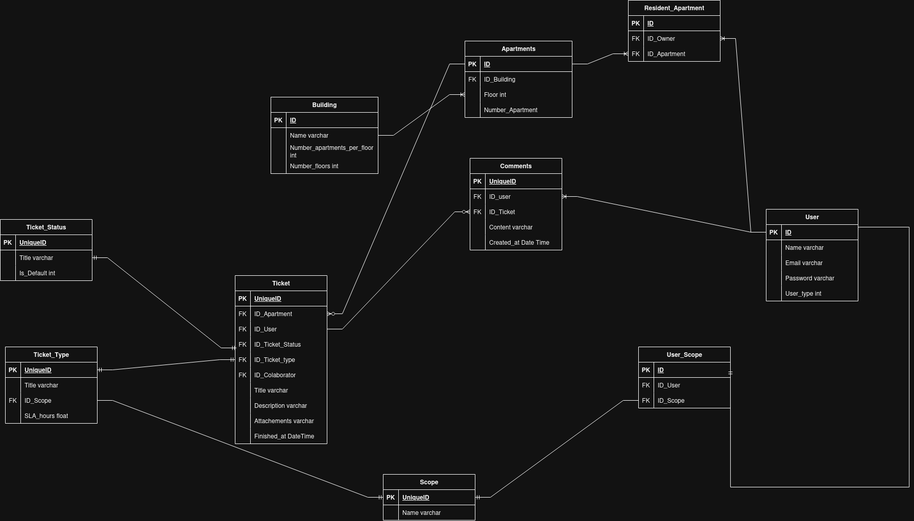

# Dunnas Condominium Manager

Sistema de gerenciamento de chamados para condomínio, com cadastro de blocos, geração automática de apartamentos, gestão de usuários por perfil e acompanhamento de tickets com comentários e anexos.

## 1. Nome do projeto

**Dunnas Condominium Manager**

Aplicação web desenvolvida em Ruby on Rails para organizar a operação de um condomínio. O sistema permite que administradores cadastrem a estrutura física do condomínio, moradores abram chamados nas suas unidades e colaboradores acompanhem e finalizem essas solicitações dentro do seu escopo de atuação.

## 2. Visão geral

Este projeto resolve um problema comum em condomínios: a comunicação entre moradores, administração e equipe técnica costuma ficar espalhada em mensagens, planilhas ou canais informais. Isso dificulta o controle de prazos, o histórico de interações e a responsabilidade sobre cada chamado.

O objetivo principal é centralizar esse fluxo em um único sistema, com regras claras de acesso por perfil:

- **Administradores** gerenciam a estrutura do condomínio, usuários, blocos, tipos de chamado e status.
- **Moradores** abrem chamados apenas nas unidades às quais estão vinculados e podem comentar nos chamados relacionados às suas permissões.
- **Colaboradores** visualizam chamados dentro do seu escopo, aplicam filtros, assumem chamados e atualizam o status até a finalização.

Além do fluxo principal de chamados, a aplicação registra comentários e anexos para manter um histórico de atendimento mais completo e auditável.

## 3. Tecnologias utilizadas

- Ruby 3.4.9
- Ruby on Rails 8.1.3
- PostgreSQL
- Devise para autenticação
- CanCanCan para autorização por perfil e escopo
- Active Storage para anexos em tickets e comentários
- Turbo e Stimulus para interações mais fluidas na interface
- Importmap para gerenciamento de JavaScript sem Node obrigatório no fluxo padrão
- Bootstrap 5 para interface

## 4. Como rodar o projeto

### Pré-requisitos

- Ruby 3.4.9
- Bundler instalado
- Git
- PostgreSQL em execução, se você for rodar localmente sem Docker
- Docker e Docker Compose, se quiser subir tudo em container


## Execução com Docker Compose

O projeto foi configurado para subir com Docker Compose. Nesse modo, o container da aplicação executa o entrypoint do projeto, que prepara o banco e carrega os seeds automaticamente quando o servidor sobe.

### O que acontece ao subir com Docker

O fluxo do container está definido em [bin/docker-entrypoint](bin/docker-entrypoint):

```bash
./bin/rails db:prepare
./bin/rails db:seed
```

Ou seja:

- o banco é criado e migrado com `db:prepare`;
- os dados iniciais são carregados com `db:seed`;
- depois disso o servidor Rails é iniciado normalmente.

### Comando para subir o ambiente

```bash
docker compose up --build
```

O `--build` garante que a imagem seja reconstruída caso haja mudanças no Dockerfile ou nas dependências.

### Serviços que sobem junto

- **app**: aplicação Rails em desenvolvimento;
- **db**: PostgreSQL;
- **adminer**: interface opcional para inspecionar o banco.

### Acesso após subir

- Aplicação: `http://localhost:3000`
- Adminer: `http://localhost:8080`

### Credenciais iniciais

As credenciais de acesso são as mesmas criadas pelos seeds:

- **Administrador**
	- E-mail: `admin@dunnas.com.br`
	- Senha: `Dunnas@2024`

- **Colaborador**
	- E-mail: `tec1@dunnas.com.br`
	- Senha: `Dunnas@2024`

- **Morador**
	- E-mail: `residente1@example.com`
	- Senha: `Residente@2024`


## 5. Estrutura do projeto

### `app/models`

Contém as entidades de domínio e as regras centrais do sistema.

- `Building`, `Apartment`, `Ticket`, `Comment`, `User`, `TicketType`, `TicketStatus` e `Scope` representam a estrutura do condomínio e o fluxo dos chamados.
- `Ability` concentra as regras de autorização por perfil.

### `app/controllers`

Orquestra as requisições HTTP, prepara dados para a interface e aplica regras de acesso.

- `TicketsController` gerencia o ciclo de vida dos chamados.
- `CommentsController` controla comentários, histórico e permissões.
- `BuildingsController`, `UsersController`, `TicketTypesController`, `TicketStatusesController` e `ScopesController` cuidam da administração do sistema.

### `app/services`

Usado para processos que envolvem mais de uma regra de negócio ou mais de um modelo.

- `Buildings::Create` cria o prédio e gera automaticamente os apartamentos.
- `Tickets::FormOptions` organiza as opções dos formulários e filtros.

### `app/queries`

Centraliza consultas mais complexas para evitar controllers gordos.

- `Tickets::IndexQuery` monta a listagem de chamados com filtros e autorização.
- `Comments::IndexQuery` monta a timeline de comentários com carregamento otimizado.

### `app/helpers`

Contém lógica de apresentação, como formatação de nomes, datas e textos exibidos na view.

### `app/views`

Contém a interface do sistema, incluindo telas de listagem, formulários, modais e componentes reutilizáveis.


## 6. Decisões de arquitetura

### Uso de Active Storage para anexos

O sistema permite anexar arquivos em chamados e comentários. Para isso, foi usado Active Storage, que já faz parte do ecossistema Rails.

Por que essa escolha:

- reduz dependências externas;
- integra bem com o restante da aplicação;
- facilita o armazenamento local em desenvolvimento;
- permite evoluir para S3 ou outro serviço no futuro sem reescrever o domínio;
- mantém a implementação simples para um projeto em crescimento.

Trade-off: Active Storage é muito prático para a maioria dos casos, mas não é a melhor opção quando há workflows de upload extremamente customizados. Para este projeto, o ganho de simplicidade e manutenção pesa mais do que a perda de flexibilidade avançada.

### Organização dos controllers

Os controllers foram mantidos como orquestradores de fluxo HTTP. Eles recebem a requisição, chamam serviços ou query objects e devolvem a resposta.


### Onde fica a lógica de negócio

A lógica de negócio ficou principalmente em models e classes de apoio especializadas.

- `Ticket#take_by!` e `Ticket#close!` encapsulam transições importantes de estado.
- `Ability` centraliza permissões por papel e por escopo.
- `Buildings::Create` coordena a criação do prédio e a geração automática de apartamentos.
- `Tickets::IndexQuery` e `Comments::IndexQuery` tratam consultas mais ricas sem poluir controllers.

Por que esse desenho:

- regras de negócio precisam estar perto dos dados que elas alteram;
- comandos como fechar ou assumir chamado exigem consistência e, em alguns casos, bloqueio de concorrência;
- query objects deixam filtros e joins testáveis sem acoplar tudo à camada HTTP.

### Uso de services e queries

O projeto usa services e queries apenas quando isso traz clareza real.

- Services foram usados quando há coordenação de passos, como gerar apartamentos automaticamente ou preparar opções de tela.
- Query objects foram usados quando a consulta ficou grande demais para ficar dentro do controller.

Trade-off: cria mais arquivos, mas o resultado é um código mais fácil de ler e manter.

### Autorização centralizada com CanCanCan

As regras de acesso estão no `Ability`, o que evita espalhar `if user.admin?` pela aplicação inteira.

Isso deixa mais claro:

- quem pode ver cada recurso;
- quem pode criar, editar ou excluir;
- qual é o escopo de cada papel;
- onde ajustar uma regra quando ela mudar.

## 7. Boas práticas aplicadas

- **MVC**: separação entre modelos, controllers e views.
- **SRP**: cada classe tenta fazer apenas uma coisa principal.
- **DRY**: lógica repetida foi extraída para helpers, queries e services.
- **Least privilege**: usuários só acessam o que realmente precisam.
- **Nested resources**: comentários vivem dentro do ticket, o que reflete a estrutura real do domínio.

## 8. Possíveis melhorias futuras

- Adicionar paginação para listas de tickets e comentários.
- Melhorar a busca e os filtros da listagem de chamados.
- Criar notificações para novos tickets, comentários e mudanças de status.
- Permitir pré-visualização e remoção individual de anexos.
- Adicionar trilha de auditoria para eventos importantes do ticket.
- Expandir a cobertura de testes para services, queries e regras de autorização.
- Introduzir dashboard com métricas operacionais para administradores.
- Melhorar internacionalização das mensagens da interface.
- Exportar relatórios em PDF ou CSV.

## 9. Banco de dados e diagrama relacional

A modelagem do banco foi criada no draw.io. A forma mais prática de disponibilizar isso no repositório é manter dois arquivos:

1. Uma exportação visual para o README. Neste projeto, a imagem está em:

```text
docs/Banco-Dados-Projeto-Dunnas-png.drawio.png
```

Imagem atual do diagrama (em `docs/`):


